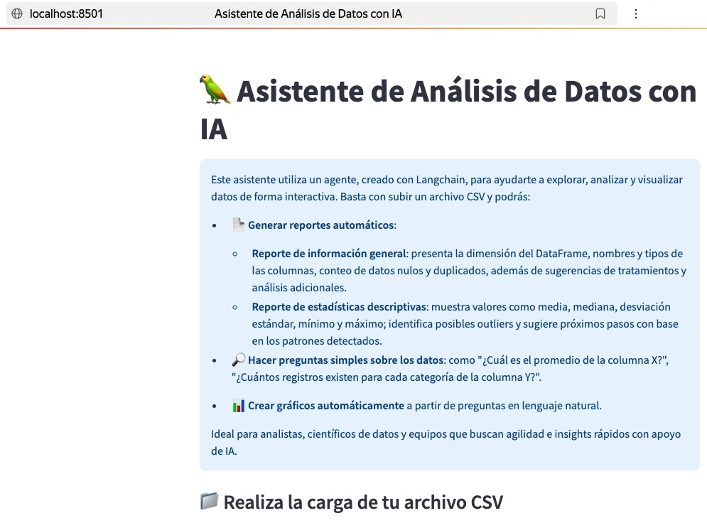

# Agentes-langchain-alura-g10

Este repositorio contiene los scripts de un agente ReAct para análisis de datos. Está construido según el curso de Alura **"LangChain: Automatizando el análisis de datos con agentes"** como parte de la formación de G10. El código fue ajustado según los últimos requerimientos de las librerías de Python y de los modelos de LLM.

## Configurar el ambiente de desarrollo

Descarga el proyecto y ubícate dentro de su directorio. Abre una terminal en esta ubicación y crea un ambiente virtual con el siguiente comando:
```
python -m venv .venv
```

Esto creará el directorio del ambiente virtual. Dependiendo de tu sistema operativo, el script de activación se encontrará en una carpeta interna diferente (```Scripts``` en Windows o ```bin``` en macOS/Linux).

### Activar el ambiente virtual

En Windows (PowerShell/CMD):
```
.\.venv\Scripts\activate
```

En macOS o Linux:
```
source .venv/bin/activate
```

O *alternativamente*:
```
. .venv/bin/activate
```

Notarás que aparece ```(.venv)``` entre paréntesis al inicio de la línea, lo que significa que estás dentro del ambiente virtual.

### Desactivar el ambiente

Si necesitas salir del ambiente virtual, simplemente escribe:
```
deactivate
```

Al hacerlo, el indicador (.venv) desaparecerá de tu terminal de inmediato.

## Configuración de secretos

Dentro del directorio raíz del proyecto, crea un archivo llamado ```.env```. Agrega tu llave de API de Groq de la siguiente manera y guarda el archivo:
```
GROQ_API_KEY="gsk_PZU316B..."
```

⚠️ Importante: Nunca compartas ni expongas este archivo .env. Esta llave es secreta y personal.

## Instalación de las librerías

Ejecuta el siguiente comando en tu terminal para instalar todas las dependencias necesarias:
```
pip install -r requirements.txt
```

## Probar la app

Para iniciar la interfaz de usuario, ejecuta:
```
streamlit run app.py
```

### Captura de pantalla de la aplicación



### Solución de problemas (Segmentation Fault)

Si al probar la app en macOS/Linux te topas con un error de este tipo:
```
zsh: segmentation fault  streamlit run app.py
```

Se debe a un conflicto de binarios en las librerías científicas. Puedes solucionarlo haciendo una reinstalación limpia compilada desde la fuente:
```
pip uninstall -y pandas matplotlib seaborn
pip cache purge
pip install --no-binary :all: pandas==2.2.3 matplotlib==3.10.1 seaborn==0.13.2
```

Después de que termine, vuelve a lanzar la aplicación:
```
streamlit run app.py
```
